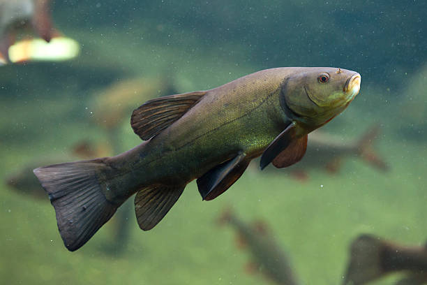

# dinov2.cpp

DINOv2 pretrained visual models in C/C++ using ggml and OpenCV.

## Description

This project provides an implementation of the DINOv2 family of models in C++. These foundation models have been pretrained
for image-level and pixel-level visual tasks, and provide a broad range of possible applications in image analysis. We aim 
to provide all the functionalities available in the [pytorch implementation](https://github.com/facebookresearch/dinov2) in C++.
This lightweight version of DINOv2 is intended to reduce inference time and required memory, using [ggml](https://github.com/ggerganov/ggml)
and [OpenCV](https://github.com/opencv/opencv), particularly for use on edge devices. This implementation was heavily inspired by and built on 
existing code from [vit.cpp](https://github.com/staghado/vit.cpp).


<details>
<summary>Table of Contents</summary>

- [dinov2.cpp](#dinov2cpp)
    - [Description](#description)
    - [Features](#features)
    - [DINOv2 Overview](#dinov2-overview)
    - [Quick example](#quick-example)
    - [Convert PyTorch to GGUF](#convert-pytorch-to-gguf)
    - [Build](#build)
        - [Simple build](#simple-build)
        - [Per device optimizations](#per-device-optimizations)
            - [For AMD host processors](#for-amd-host-processors)
        - [Using OpenMP](#using-openmp)
    - [Run](#run)
    - [Benchmark against PyTorch](#benchmark-against-pytorch)
        - [ViT inference](#vit-inference)
        - [Benchmark on your machine](#benchmark-on-your-machine)
    - [Quantization](#quantization)
        - [Results](#results)
    - [To-Do List](#to-do-list)

</details>

## Features

- Dependency-free and lightweight inference thanks to [ggml](https://github.com/ggerganov/ggml).
- Support for DINO models from huggingface with conversion from pytorch weights to gguf.


Todo:
- 4-bit, 5-bit and 8-bit quantization support.


## DINOv2 Overview: 

The implemented architecture is based on the DINOv2 architecture:

- [DINOv2: Learning Robust Visual Features without Supervision](https://arxiv.org/abs/2304.07193)

## Quick example

<details>


  <p align="center">
    
  </p>

  <p align="center">
    
  </p>

  <summary>See output</summary>
  <pre>
  $ ./bin/dinov2 -t 4 -m ../ggml-model-f16.gguf -i ../assets/tench.jpg 
  main: seed = 42
  main: loaded image '../assets/tench.jpg' (408 x 612)
  dino_model_load: loading model from '../ggml-model-f16.gguf' - please wait
  dino_model_load: hidden_size            = 384
  dino_model_load: num_hidden_layers      = 12
  dino_model_load: num_register_tokens    = 4
  dino_model_load: num_attention_heads    = 6
  dino_model_load: patch_size             = 14
  dino_model_load: img_size               = 518
  dino_model_load: ftype                  = 1
  dino_model_load: qntvr                  = 0
  dino_model_load: num_classes            = 1000
  main: preprocessed image (224 x 224)


&gt; tench, Tinca tinca : 0.90
&gt; coho, cohoe, coho salmon, blue jack, silver salmon, Oncorhynchus kisutch : 0.05
&gt; goldfish, Carassius auratus : 0.01
&gt; suit, suit of clothes : 0.01
&gt; barracouta, snoek : 0.00

main: graph computation took 349 ms
  </pre>
</details>

## Convert PyTorch to GGUF

```bash
# clone the repo recursively
git clone --recurse-submodules git@github.com:lavaman131/dinov2.cpp.git

cd dinov2.cpp

uv venv
# for MacOS/Linux
source .venv/bin/activate
# for Windows
.venv\Scripts\activate
uv sync --frozen

# convert the weights to gguf : vit tiny with patch size of 16 and an image 
# size of 384 pre-trained on ImageNet21k and fine-tuned on ImageNet1k
# DINOv2 weights are always fp16
# without registers
python ./scripts/dinov2-to-gguf.py --model_name facebook/dinov2-small-imagenet1k-1-layer --ftype 1
# with registers
python ./scripts/dinov2-to-gguf.py --model_name facebook/dinov2-with-registers-small-imagenet1k-1-layer --ftype 1
python ./scripts/vit-to-ggml.py --model_name vit_tiny_patch16_384.augreg_in21k_ft_in1k --ftype 1

```

> **Note:** You can also download the converted weights from [Hugging Face](https://huggingface.co/staghado/vit.cpp)
> directly.

> ```wget https://huggingface.co/staghado/vit.cpp/blob/main/tiny-ggml-model-f16.gguf```

## Build

### Simple build

#### Install OpenCV

Refer to instructions on the [OpenCV]((https://opencv.org/get-started/)) website to install OpenCV on your machine.

Add the `-c` flag when running to return the output predictions. Omitting the flag (by default) will return the patch
tokens.

```bash
# on MacOS/Linux 
mkdir build && cd build
cmake -DCMAKE_BUILD_TYPE=Release .. && make -j 4
./bin/dinov2 -m ../ggml-model-f16.gguf -i ../assets/tench.jpg
```

```bash
# on Windows
mkdir build ; cd build
cmake -G "Ninja" -DCMAKE_BUILD_TYPE=Release ..
ninja
./bin/dinov2.exe -m ../ggml-model-f16.gguf -i ../assets/tench.jpg
```

The optimal number of threads to use depends on many factors and more is not always better. Usually using a number of
threads equal to the number of available physical cores gives the best performance in terms of speed.

### Per device optimizations

Generate per-device instructions that work best for the given machine rather than using general CPU instructions.
This can be done by specifying `-march=native` in the compiler flags.

* Multi-threading and vectorization
* Loop transformations(unrolling)

#### For AMD host processors

You can use a specialized compiler released by AMD to make full use of your specific processor's architecture.
Read more here : [AMD Optimizing C/C++ and Fortran Compilers (AOCC)](https://www.amd.com/en/developer/aocc.html)

You can follow the given instructions to install the AOCC compiler.

Note : For my AMD Ryzen 7 3700U, the improvements were not very significant but for more recent processors there could
be a gain in using a specialized compiler.

### Using OpenMP

Additionally compile with OpenMP by specifying the `-fopenmp` flag to the compiler in the CMakeLists file,
allowing multithreaded runs. Make sure to also enable multiple threads when running, e.g.:

```bash
OMP_NUM_THREADS=4 ./bin/vit -t 4 -m ../ggml-model-f16.bin -i ../assets/tench.jpg
```

## Run

```bash
usage: ./bin/vit [options]

options:
    -h, --help              show this help message and exit
    -s SEED, --seed SEED    RNG seed (default: -1)
    -t N, --threads N       number of threads to use during computation (default: 4)
    -m FNAME, --model FNAME model path (default: ../ggml-model-f16.bin)
    -i FNAME, --inp FNAME   input file (default: ../assets/tench.jpg)
    -k N, --topk N          top k classes to print (default: 5)
    -e FLOAT, --epsilon     epsilon (default: 0.000001)
```

## Benchmark against PyTorch

First experiments on Intel Core i9-14900HX show inference speedups (up to 3x faster for small model, ~1.5-2x faster for the rest) compared to native PyTorch inference.

### DINOv2 inference

You can efficiently run DINOv2 inference on the CPU.

Memory requirements and inference speed on Intel Core i9-14900HX (24 cores, 32 threads) for both native PyTorch and `dinov2.cpp`.
Using a thread count greater than 10 provides marginal improvements, but 32 threads were used for these runs. The reported results of inference speed correspond to 100 runs
averages for both PyTorch and `dinov2.cpp`.

#### DINOv2 with Register Tokens
| Model | Max Mem(PyTorch) |   Max Mem   | Speed(PyTorch) |    Speed    |
|:-----:|:----------------:|:-----------:|:--------------:|:-----------:|
| small  |     ~457 MB      | **~110 MB**  |     297 ms     | **97 ms**  |
| base |     ~720 MB      | **~367 MB**  |     436 ms     | **269 ms**  |
| large  |     ~1.57 GB     | **~1.2 GB** |    1331 ms     | **802 ms** |
| giant |     ~4.8 GB     | **~4.4 GB** |    4472 ms     | **2775 ms** |

> **Note:** The models used are of the form `dinov2-with-registers-{size}-imagenet1k-1-layer`

#### DINOv2 without Register Tokens
| Model | Max Mem(PyTorch) |   Max Mem   | Speed(PyTorch) |    Speed    |
|:-----:|:----------------:|:-----------:|:--------------:|:-----------:|
| small  |     ~455 MB      | **~110 MB**  |     181 ms     | **73 ms**  |
| base |     ~720 MB      | **~365 MB**  |     462 ms     | **242 ms**  |
| large  |     ~1.55 GB     | **~1.2 GB** |    1288 ms     | **775 ms** |
| giant |     ~4.8 GB     | **~4.4 GB** |    4384 ms     | **2725 ms** |

> **Note:** The models used are of the form `dinov2-{size}-imagenet1k-1-layer`.

### Benchmark on your machine

In order to test the inference speed on your machine, you can run the following scripts:

```bash
chmod +x scripts/benchmark.*

# install memory_profiler & threadpoolctl
pip install memory_profiler threadpoolctl

# run the benchmark of PyTorch
python scripts/benchmark.py

# run the benchmark of dinov2.cpp for non-qunatized model
./scripts/benchmark.sh

# to run the benchamrk for qunatized models; 4 threads and quantize flag
./scripts/benchmark.sh 4 1
```

Both scripts use 4 threads by default. In Python, the `threadpoolctl` library is used to limit the number of threads
used by PyTorch.

## Quantization

Todo:
Quantization is not currently supported for dinov2.cpp

`vit.cpp` supports many quantization strategies from ggml such as q4_0, q4_1, q5_0, q5_1 and q8_0 types.
You can quantize a model in F32 (the patch embedding is in F16) to one of these types by using the `./bin/quantize`
binary.

```
usage: ./bin/quantize /path/to/ggml-model-f32.gguf /path/to/ggml-model-quantized.gguf type                              
  type = 2 - q4_0                                                                                                       
  type = 3 - q4_1                                                                                                       
  type = 6 - q5_0                                                                                                       
  type = 7 - q5_1                                                                                                       
  type = 8 - q8_0                                                                                                       
```

For example, you can run the following to convert the model to q5_1:

```shell
./bin/quantize ../tiny-ggml-model-f16.gguf ../tiny-ggml-model-f16-quant.gguf 7
```

Then you can use `tiny-ggml-model-f16-quant.gguf` just like the model in F16.

### Results

Here are the benchmarks for the different models and quantizations on my machine:
For accurate estimation of run times, these benchmarks were run 100 times each.

| Model | Quantization | Speed (ms) | Mem (MB) |
|:-----:|:------------:|:----------:|:--------:|
| tiny  |     q4_0     |   105 ms   |  12 MB   |
| tiny  |     q4_1     |   97 ms    |  12 MB   |
| tiny  |     q5_0     |   116 ms   |  13 MB   |
| tiny  |     q5_1     |   112 ms   |  13 MB   |
| tiny  |     q8_0     |   90 ms    |  15 MB   |
| small |     q4_0     |   240 ms   |  23 MB   |
| small |     q4_1     |   224 ms   |  24 MB   |
| small |     q5_0     |   288 ms   |  25 MB   |
| small |     q5_1     |   277 ms   |  27 MB   |
| small |     q8_0     |   228 ms   |  33 MB   |
| base  |     q4_0     |   704 ms   |  61 MB   |
| base  |     q4_1     |   626 ms   |  66 MB   |
| base  |     q5_0     |   851 ms   |  71 MB   |
| base  |     q5_1     |   806 ms   |  76 MB   |
| base  |     q8_0     |   659 ms   |  102 MB  |
| large |     q4_0     |  2189 ms   |  181 MB  |
| large |     q4_1     |  1919 ms   |  199 MB  |
| large |     q5_0     |  2676 ms   |  217 MB  |
| large |     q5_1     |  2547 ms   |  235 MB  |
| large |     q8_0     |  1994 ms   |  325 MB  |


This project was built on and highly inspired by vit.cpp:

* [vit.cpp](https://github.com/staghado/vit.cpp)

